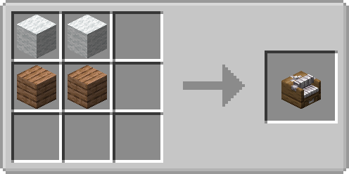
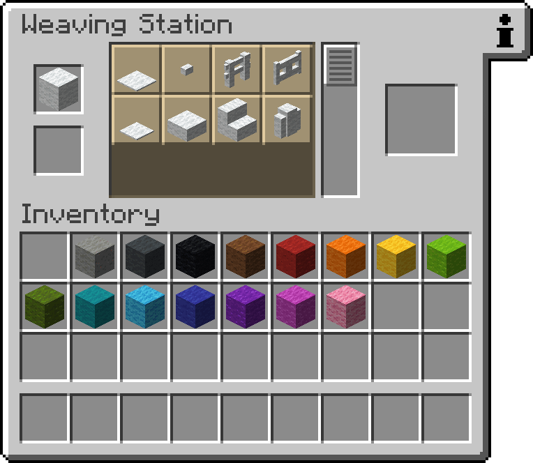
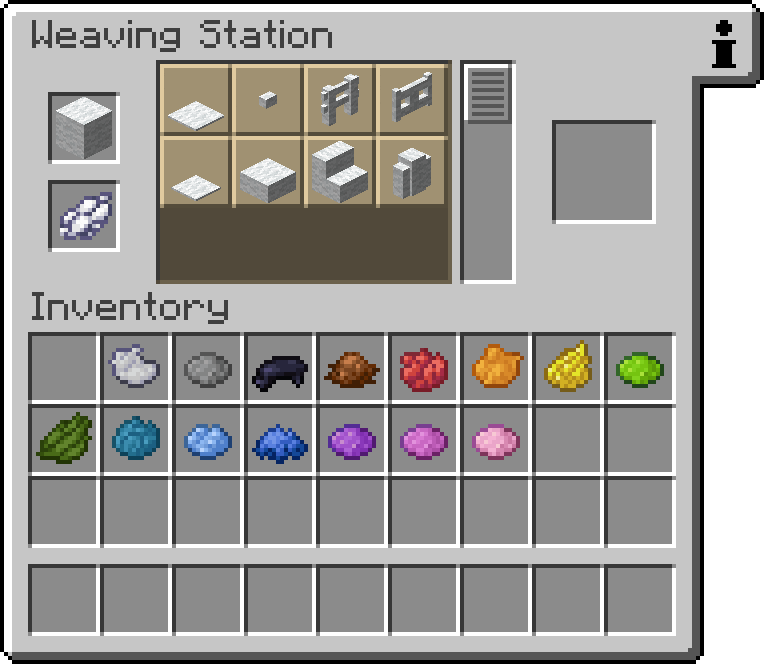
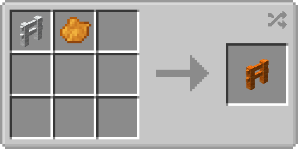

# The Wool Collection  

Adds more wool blocks to the game!

## New Wool Variants

- added new wool variants
    - 16 new wool fences
    - 16 new wool fences gates
    - 16 new wool stairs
    - 16 new wool slabs
    - 16 new wool walls
    - 16 new wool buttons
    - 16 new wool pressure plates
- right clicking with shears will drop them instantly
- right clicking with a dye will change the color of the block

## Recipes

all newly added blocks are crafted in the weaving station

### Weaving Station

  

any type of wool and wood_planks can be used

#### Normal Recipes

placing any color of wool in the top slot lets you craft the corresponding colored blocks

#### Dyed Recipes

placing any color of wool in the top slot, and a dye in the bottom slot, lets you craft the corresponding colored blocks

### Recoloring Recipes

all blocks added by this mod can be simply recolored by placing any color of dye in the crafting grid with the block  
example gif: any colored fence can be recolored to orange with orange dye

## Project setup

The project structure is based on the [MultiLoader-Template](https://github.com/jaredlll08/MultiLoader-Template) by
jaredlll08
